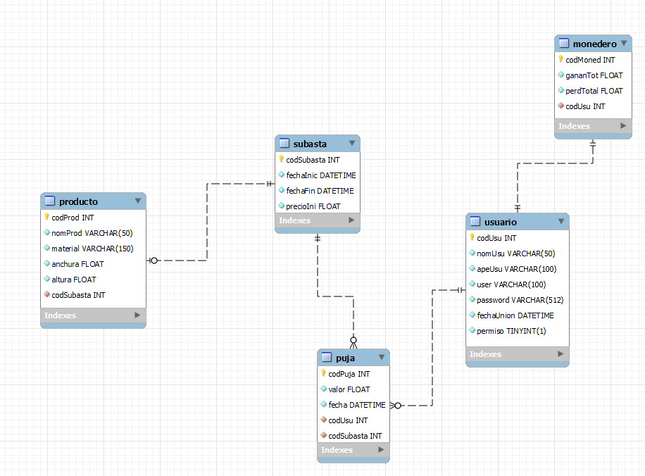
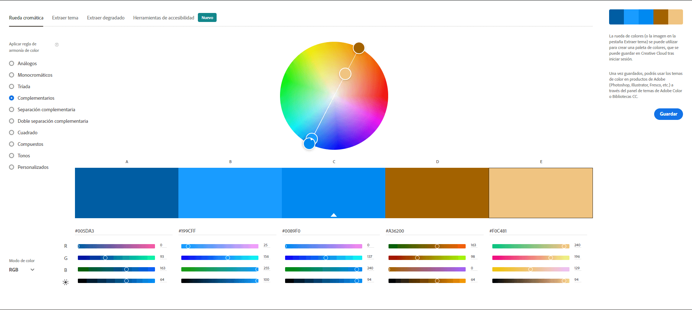
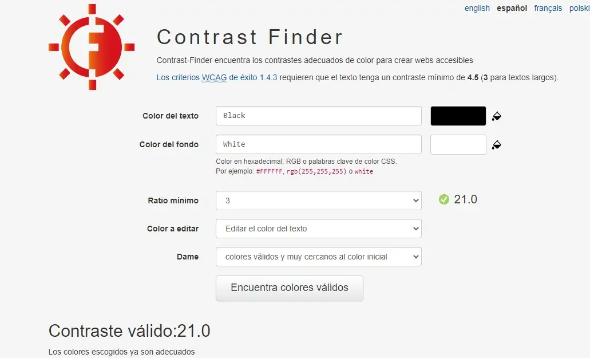

# Subasta Total
Subasta o también conocido como Subasta total es una aplicación web donde todas tus pujas solamente se ven influidas por fondos viruales (sin dinero físico o criptomonedas). Es totalmente virtual, no se dejen engañar y pujen ahora que la cuenta atrás acaba pronto.

## Tecnologías
| Frontend | Backend | Others |
|----------|---------|--------|

 |       
| 
      
|

## Modelado

## Desarrollo en Entorno cliente

## Desarrollo en Entorno servidor

## Despliegue de aplciaciones web
Buscando un proveedor de hosting

## Diseño de interfaces
| Color dominante: naranja |
|--------------------------|
| La impulsividad de los compradores para conseguir los productos que hay en oferta. Las reacciones de los pujadores y color dominante (naranja) son los facotres que forman esta gran combinación. Lo más llamativo de cada subasta celebrada será el ganador/a, la cantidad de pujas, y el último valor para el producto. |

Paleta de colores: complementaria

Fuente del prototipo: Open Sans

Open Sans es una fuente sans-serif y este tipo de fuente mejora la legibilidad en todos los tipos de 
dispositivos y facilita la lectura a las personas con dificultades de vision.

Fuente acompañante: Noto Sans

Esta fuente también termina en Sans y es sans-serif. Su unión no sería un problema.

Contrast finder

Equilibrio visual y tensión compositiva.

- Equilibrio informal: deja la idea simetría, dependiendo del objeto visualizado, este puede tener un gran valor y viceversa. Se basa en asimetría intencionada. Unas tienen menor peso que las grandes.
- Forma regular = aumento de peso (valor)
- Colores luminosos e intensos tienen mayor valor
- El equilibrio depende de su posición
- Técnica sugestiva: trata de llamar la atención del usuario, utilizando puntos de apoyo

Prototipo 1920x1080 (portátil): [Prototipo](https://www.figma.com/proto/MGazLbzsWFdFpbrXs1uyWc/Prototipo-subasta-(DESKTOP)?node-id=1%3A5&scaling=min-zoom&page-id=0%3A1&starting-point-node-id=1%3A5)

Enlance de prototipo 360x640 (móvil): [Prototipo](https://www.figma.com/proto/WEoUJsjENQh8x2WGeOYmgg/Prototipo-subasta-(PHONE)?node-id=4%3A3&scaling=min-zoom&page-id=0%3A1&starting-point-node-id=1%3A5)

## Horas de libre configuración
Bucar la forma más eficiente de traducir las páginas del proyecto (Mínimo: inglés o español)

## Bibilografía
